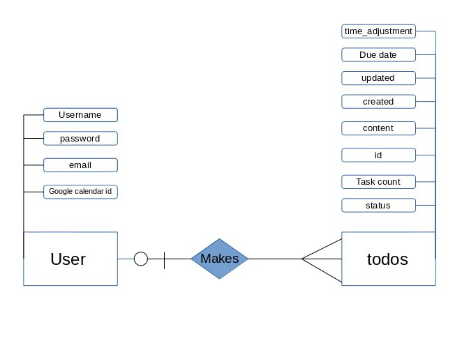

User Stories
================
John is looking for a new to-do list app. He wants something that organizes simple to-do lists in a more logical manner. He wants a site to go to that he can log into and save all his relevant to dos and can access from anywhere.

George has trouble keeping track of the things he has done. He can never remember if it's his turn to bring the milk and cookies because he can't remember the last time that he did it.

Artemis has always wanted to create a diary and yet just hasn't gotten around to it. She wants the ability to log into a site and quickly create a diary from the things that she has already done.

Scope
============

My app will allow users to easily record things they have done in the past and things would like to complete in the future. My stretch goal is to use the [Google calendar api](https://developers.google.com/google-apps/calendar/quickstart/nodejs) to import new users old calendar entries and also edit and add current calendar entries.

Wireframes
============

#### Landing Page:

#### Main Page:

ERDs
=============

Milestones
===========
- [ ] Get Approved
